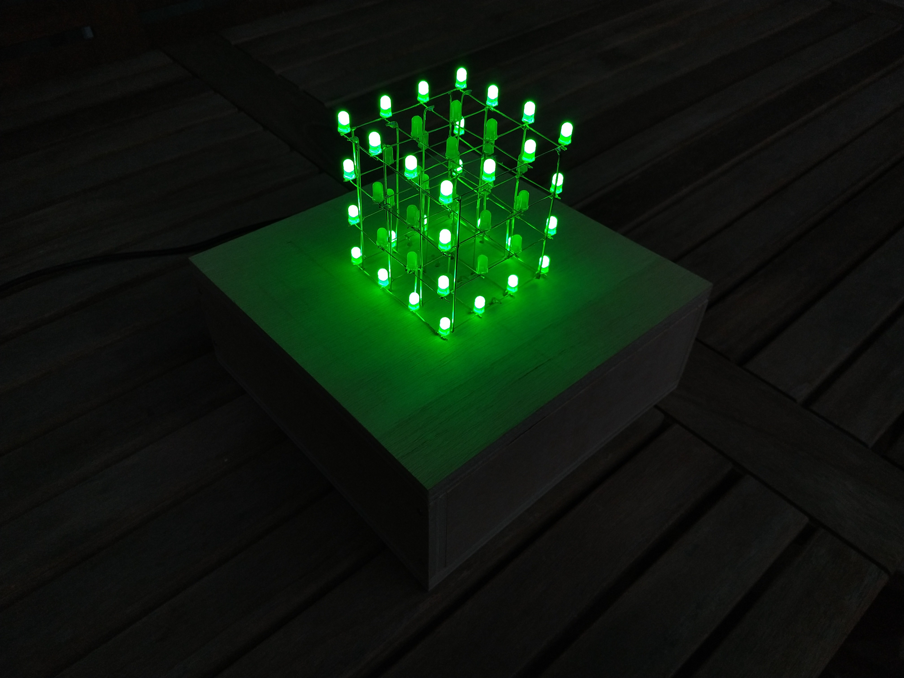
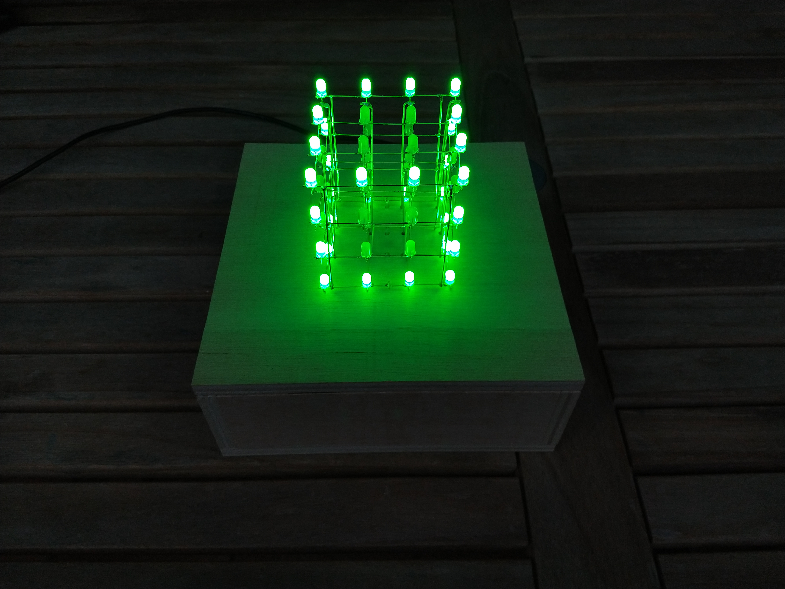
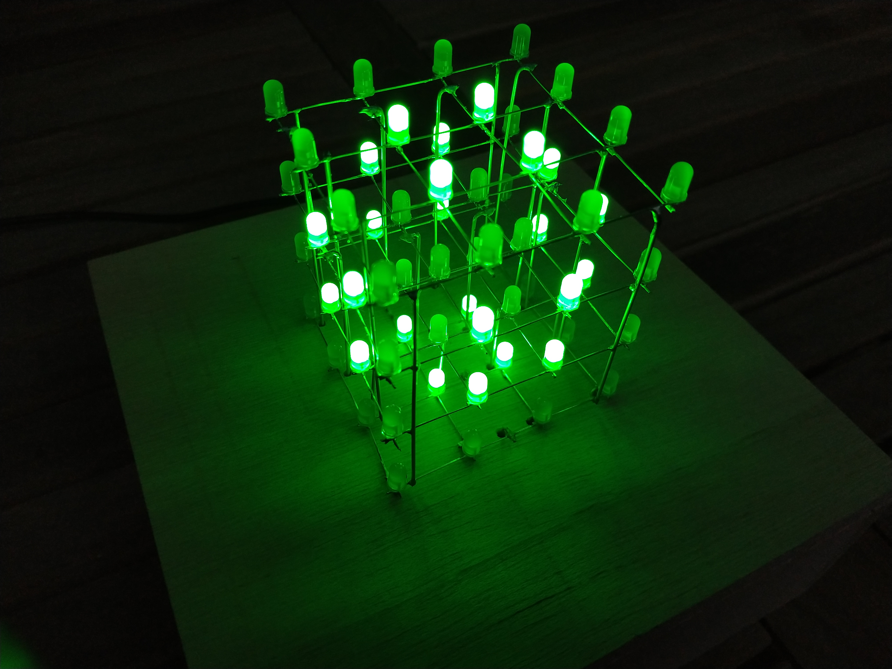
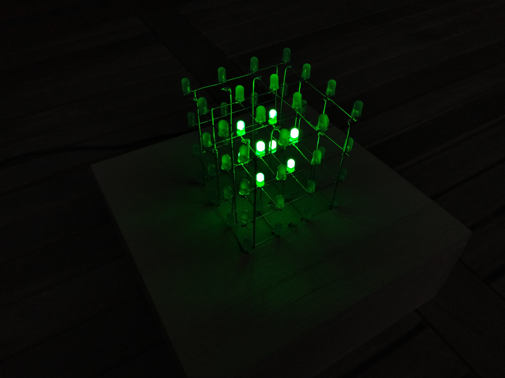

# LED_Cube
A 4x4x4 LED cube I built after seeing something similar on YouTube. Uses an Arduino Uno as the controller. As can be seen in the pictures, there are only 20 outputs from the circuit board to the 64 LEDs in the cube: This cube works on a visual effect called persistence of vision, the code running in the Arduino constantly activates and deactivates each layer, making it appear as if all of them were lit simultaneously. Included in the code are several light sequences.

 ### Here are some pics of the cube
 
 
 
 
 
 
 
 
